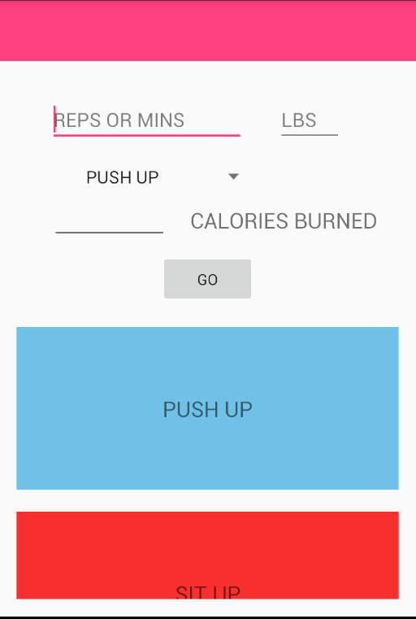

# PROG 01: Crunch Time

A visually appealing app that calculates number of calories burned for certain excerises. 

## Authors

Brian Nguyen EMAIL: brian.ngueyn@berkeley.edu

## Demo Video

See DEMO VIDEO ( https://youtu.be/llzCJ8neXz4)

## Screenshots

## Acknowledgments

support from SMITA 

*Feel free to enhance your README. For Markdown syntax, see [the GitHub Guides](https://guides.github.com/features/mastering-markdown/). Remove this line in your submission.*
